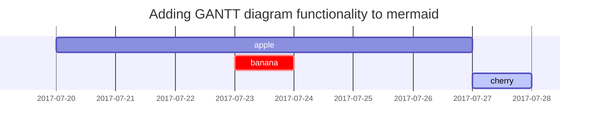

This post is to show Markdown syntax rendering on [**Chirpy**](https://github.com/cotes2020/jekyll-theme-chirpy/fork), you can also use it as an example of writing. Now, let's start looking at text and typography. The title figure is the view open this site on Macbook Pro and iPhone, We can easy to make this mockup from <https://facebook.design/devices>.


## Titles
---
# H1 - heading

<h2 data-toc-skip>H2 - heading</h2>

<h3 data-toc-skip>H3 - heading</h3>

<h4>H4 - heading</h4>
---
<br>

## Paragraph

I wandered lonely as a cloud

That floats on high o'er vales and hills,

When all at once I saw a crowd,

A host, of golden daffodils;

Beside the lake, beneath the trees,

Fluttering and dancing in the breeze.

## 《滕王阁序》
[王勃](https://baike.baidu.com/item/%E7%8E%8B%E5%8B%83/248912?fr=kg_general)

{: style="max-width: 180px"}_王勃画像_

{: width="972" height="589" style="max-width: 200px" .right}
>豫章故郡，洪都新府。星分翼轸，地接衡庐。襟三江而带五湖，控蛮荆而引瓯越。物华天宝，龙光射牛斗之墟；人杰地灵，徐孺下陈蕃之榻。雄州雾列，俊采星驰。台隍枕夷夏之交，宾主尽东南之美。都督阎公之雅望，棨戟遥临；宇文新州之懿范，襜帷暂驻。十旬休假，胜友如云；千里逢迎，高朋满座。腾蛟起凤，孟学士之词宗；紫电青霜，王将军之武库。家君作宰，路出名区；童子何知，躬逢胜饯。

>时维九月，序属三秋。潦水尽而寒潭清，烟光凝而暮山紫。俨骖騑于上路，访风景于崇阿；临帝子之长洲，得天人之旧馆。层峦耸翠，上出重霄；飞阁流丹，下临无地。鹤汀凫渚，穷岛屿之萦回；桂殿兰宫，即冈峦之体势。

>披绣闼，俯雕甍，山原旷其盈视，川泽纡其骇瞩。闾阎扑地，钟鸣鼎食之家；舸舰弥津，青雀黄龙之舳。云销雨霁，彩彻区明。落霞与孤鹜齐飞，秋水共长天一色。渔舟唱晚，响穷彭蠡之滨；雁阵惊寒，声断衡阳之浦。

>遥襟甫畅，逸兴遄飞。爽籁发而清风生，纤歌凝而白云遏。睢园绿竹，气凌彭泽之樽；邺水朱华，光照临川之笔。四美具，二难并。穷睇眄于中天，极娱游于暇日。天高地迥，觉宇宙之无穷；兴尽悲来，识盈虚之有数。望长安于日下，目吴会于云间。地势极而南溟深，天柱高而北辰远。关山难越，谁悲失路之人？萍水相逢，尽是他乡之客。怀帝阍而不见，奉宣室以何年？

>嗟乎！时运不齐，命途多舛。冯唐易老，李广难封。屈贾谊于长沙，非无圣主；窜梁鸿于海曲，岂乏明时？所赖君子见机，达人知命。老当益壮，宁移白首之心？穷且益坚，不坠青云之志。酌贪泉而觉爽，处涸辙以犹欢。北海虽赊，扶摇可接；东隅已逝，桑榆非晚。孟尝高洁，空余报国之情；阮籍猖狂，岂效穷途之哭！

>勃，三尺微命，一介书生。无路请缨，等终军之弱冠；有怀投笔，慕宗悫之长风。舍簪笏于百龄，奉晨昏于万里。非谢家之宝树，接孟氏之芳邻。他日趋庭，叨陪鲤对；今兹捧袂，喜托龙门。杨意不逢，抚凌云而自惜；钟期既遇，奏流水以何惭？

>呜乎！胜地不常，盛筵难再；兰亭已矣，梓泽丘墟。临别赠言，幸承恩于伟饯；登高作赋，是所望于群公。敢竭鄙怀，恭疏短引；一言均赋，四韵俱成。请洒潘江，各倾陆海云尔：

>滕王高阁临江渚，佩玉鸣鸾罢歌舞。

>画栋朝飞南浦云，珠帘暮卷西山雨。

>闲云潭影日悠悠，物换星移几度秋。

>阁中帝子今何在？槛外长江空自流。


## Lists

### Ordered list

1. Firstly
2. Secondly
3. Thirdly

### Unordered list

- Chapter
  - Section
    - Paragraph

### Task list

- [ ] TODO
- [x] Completed
- [ ] Defeat COVID-19
  - [x] Vaccine production
  - [ ] Economic recovery
  - [ ] People smile again

### Description list

Sun
: the star around which the earth orbits

Moon
: the natural satellite of the earth, visible by reflected light from the sun

## Block Quote

> This line shows the _block quote_.

## Prompts

> An example showing the `tip` type prompt.
{: .prompt-tip }

> An example showing the `info` type prompt.
{: .prompt-info }

> An example showing the `warning` type prompt.
{: .prompt-warning }

> An example showing the `danger` type prompt.
{: .prompt-danger }

## Tables

| Company                      | Contact          | Country |
|:-----------------------------|:-----------------|--------:|
| Alfreds Futterkiste          | Maria Anders     | Germany |
| Island Trading               | Helen Bennett    | UK      |
| Magazzini Alimentari Riuniti | Giovanni Rovelli | Italy   |

## Links

<http://127.0.0.1:4000>

## Footnote

Click the hook will locate the footnote[^footnote], and here is another footnote[^fn-nth-2].

## Images

- Default (with caption)

{: width="972" height="589" }
_Full screen width and center alignment_

<br>

- Shadow

{: .shadow width="1548" height="864" style="max-width: 90%" }
_shadow effect (visible in light mode)_

<br>

- Left aligned

{: width="972" height="589" style="max-width: 30%" .normal}

<br>

- Float to left

  {: width="972" height="589" style="max-width: 120px" .left}
  "A repetitive and meaningless text is used to fill the space. A repetitive and meaningless text is used to fill the space. A repetitive and meaningless text is used to fill the space. A repetitive and meaningless text is used to fill the space. A repetitive and meaningless text is used to fill the space. A repetitive and meaningless text is used to fill the space. A repetitive and meaningless text is used to fill the space. A repetitive and meaningless text is used to fill the space. A repetitive and meaningless text is used to fill the space. A repetitive and meaningless text is used to fill the space. A repetitive and meaningless text is used to fill the space. A repetitive and meaningless text is used to fill the space."

<br>

- Float to right

  {: width="972" height="589" style="max-width: 120px" .right}
  "A repetitive and meaningless text is used to fill the space. A repetitive and meaningless text is used to fill the space. A repetitive and meaningless text is used to fill the space. A repetitive and meaningless text is used to fill the space. A repetitive and meaningless text is used to fill the space. A repetitive and meaningless text is used to fill the space. A repetitive and meaningless text is used to fill the space. A repetitive and meaningless text is used to fill the space. A repetitive and meaningless text is used to fill the space. A repetitive and meaningless text is used to fill the space. A repetitive and meaningless text is used to fill the space. A repetitive and meaningless text is used to fill the space."

<br>

## Mermaid SVG



## Mathematics

The mathematics powered by [**MathJax**](https://www.mathjax.org/):

$$ \sum_{n=1}^\infty \frac{1}{n^2} = \frac{\pi^2}{6} $$

When $a \ne 0$, there are two solutions to $ax^2 + bx + c = 0$ and they are

$$ x = {-b \pm \sqrt{b^2-4ac} \over 2a} $$

## Inline code

This is an example of `Inline Code`.

## Filepath

Here is the `/path/to/the/file.extend`{: .filepath}.

## Code block

### Common

```
This is a common code snippet, without syntax highlight and line number.
```

### Specific Languages

#### Console

```console
$ env |grep SHELL
SHELL=/usr/local/bin/bash
PYENV_SHELL=bash
```

#### Shell

```bash
if [ $? -ne 0 ]; then
    echo "The command was not successful.";
    #do the needful / exit
fi;
```

### Specific filename

```sass
@import
  "colors/light-typography",
  "colors/dark-typography"
```
{: file='_sass/jekyll-theme-chirpy.scss'}

## Reverse Footnote

[^footnote]: The footnote source
[^fn-nth-2]: The 2nd footnote source
